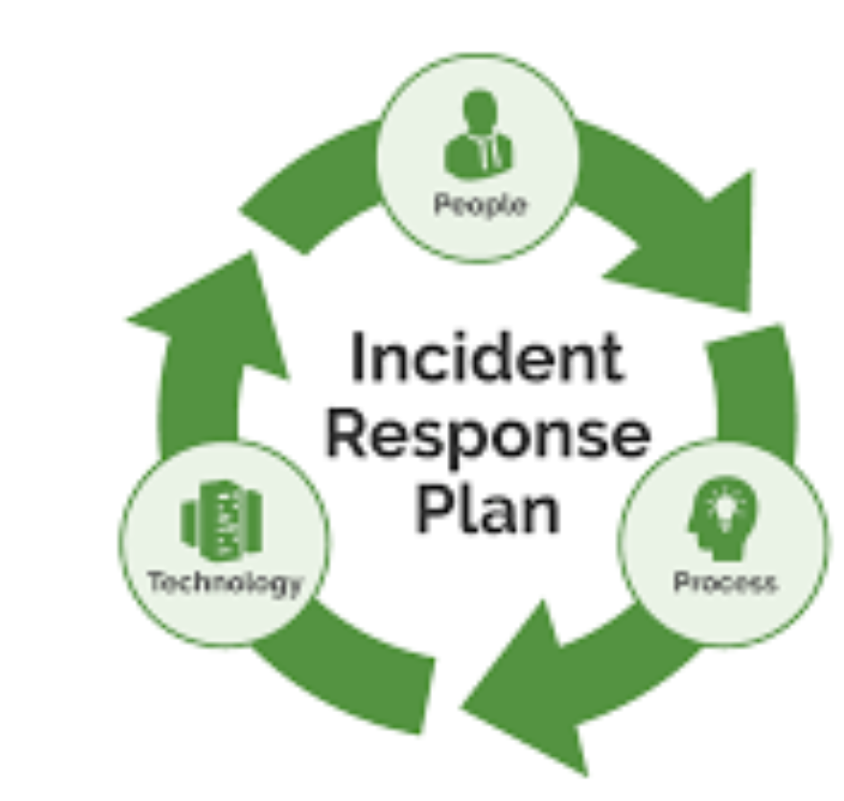

 

  

# Production Incident Runbook

<!-- TABLE OF CONTENTS -->

  
Table of Contents

  <ol>
    <li>
      <a href="#Overview">Overview</a>
    </li>
    <li>
      <a href="#Objective">Objective</a>
    </li>
	<li>
	  <a href="#Prerequisites">Prerequisites</a>
    </li>
	<li>
	  <a href="#Incident Response Steps">Incident Response Steps</a>
      <ul>
        <li><a href="#Incident Acknowledgment">Incident Acknowledgment</a></li>
        <li><a href="#Initial Validation">Initial Validation</a></li>
		<li><a href="#Useful Splunk Queries and Log analysis">Useful Splunk Queries and Log analysis</a></li>
        <li><a href="#Dynatrace Metrics Analysis">Dynatrace Metrics Analysis</a></li>
		<li><a href="#Dependency Checks">Dependency Checks</a></li>
        <li><a href="#Gather dumps - Heap dump/Thread dump/TCP dump">Gather dumps - Heap dump/Thread dump/TCP dump</a></li>
		<li><a href="#Quick Mitigation">Quick Mitigation</a></li>
        <li><a href="#Escalation">Escalation</a></li>
      </ul>
    </li>
	<li>
      <a href="#Additional Resources">Additional Resources</a>
    </li>
    <li>
      <a href="#Notes">Notes</a>
    </li>
  </ol>

## Overview

This document serves as a quick reference runbook for on-call engineers during the initial phase of troubleshooting production incidents. It highlights the steps to be taken for validating and diagnosing common issues, with links to relevant dashboards and tools.

## Objective

This document provides DevOps engineers, a structured approach for initial incident response, aiming to diagnose and potentially mitigate issues as soon as possible.

## Prerequisites

- Quick access to monitoring tools (Prometheus, Grafana, Dynatrace, Splunk)
- Basic understanding of the application architecture and its dependencies on other services

## Incident Response Steps

### 1. Incident Acknowledgment

- Acknowledge the incident.
- Join the designated communication channel (E.g., Slack, Teams) and inform about your presence in the call and actions that you are performing.

### 2. Initial Validation

- Utilize below dashboard as needed for doing initial validation

|Sequence| Feature      | What to check?                                   | Links |
|:-------------|:-------------|:----------------------------------------------|:---------:|
|Step 1| WCNP Deployment Report | Any deployment done recently?                 | [WCNP Deployment Report](http://tridents-portal.walmart.com/wcnpProductFinal "WCNP Deployment Report" )      |
|Step 2| DC to Cloud Latency         | Latency details for impact DCs from 3 Azure cloud regions i.e. SCUS, WUS & EUS                   | [DC to Cloud Latency](https://tridents-portal.walmart.com/selectDC  "DC to Cloud Latency")    |
|Step 3| Atlas App and Infra Uptime     | Uptime details of impacted ATLAS Services and Infrastructure       | [Atlas App and Infra Uptime](https://tridents-portal.walmart.com/uptimeFinal?env=PROD  "Atlas App and Infra Uptime")      |
|Step 4| AZ SQL Dashboard    |  Any CPU spike, deadlocks, disk fill, blocking etc. | [AZ SQL Dashboard](https://grafana.mms.walmart.net/d/aUZKcsP0Mg/azure-sql-dashboard?orgId=1&refresh=1m "AZ SQL Dashboard" )      |
|Step 5| MS SQL Dashboard | If using MS SQL DB, check for any CPU spike, deadlocks, disk fill, blocking etc.                 | [MS SQL Dashboard](https://grafana.mms.walmart.net/d/3XUKpigfi/atlas-db-performance-v2?orgId=1&refresh=1m  "MS SQL Dashboard" )      |
|Step 6| WCNP Resource Utilization | CPU, Memory utilization, OOM, Container restarts etc.               | [WCNP Resource Utilization](https://grafana.mms.walmart.net/d/7Wushy_mk/apps?orgId=1&from=now-7d&to=now&var-datasource=production&var-namespace=atlas-lpaas&var-cluster_id=scus-prod-a32&var-cluster_id=scus-prod-a56&var-app=All&var-interval=$__auto_interval_interval&var-long_interval=$__auto_interval_long_interval "WCNP Resource Utilization")      |
|Step 7| Dynatrace | Ongoing problem ticket for the impacted service, thread pool exhausation,heap memory utilization, purepath, any failed requests etc.                 | [Dynatrace](https://prod-walmart.dynatrace-managed.com/e/a62524c7-8dae-4cfd-856a-12b8462f3520/ui/services?gtf=-7d%20to%20now&gf=1902260220275616316&sorting=name;asc "Dynatrace")       |
|Step 8| Kafka | If problem is asociated with Kafka, check for Kafka broker health, consumer lag, consumer rebalancing                 | [Kafka](https://grafana.mms.walmart.net/d/o7eRAUOpgGz2/managed-kafka-broker-metrics?orgId=1&var-datasource=production&var-assembly=kafka-v2-atlas-scus-wus-prod&var-platform=kafka&var-environment=scus&var-cloud=prod-az-southcentralus-25&var-lenses_ip=10.236.124.36 "Kafka")      |
|Step 9| K8s | Application restart time, number of pods, health of pods etc.                 | [K8s](https://k8s-dashboard.kube-system.scus-prod-a32.cluster.k8s.us.walmart.net/#/workloads?namespace=atlas-lpaas "K8s" )      |
|Step 10| SQL DB Troubleshooting Guide | Use this for troubleshooting blocking sessions,long running query,db status, db space full, purge status , cpu utilization, data io utilization etc.                | [SQL DB Troubleshooting Guide](https://confluence.walmart.com/display/NIMAUT/SQL+DB+Troubleshooting+Guide "SQL DB Troubleshooting Guide" )      |
|Step 11| GSLB Traffic Routing | Answers by DC, Answers by cloud                | [GSLB Traffic Routing](https://grafana.mms.walmart.net/d/000000098/gslb-by-domain?orgId=1&refresh=1m&var-datasource=production&var-origin=inv-server-cloud-us-perf-cell000.atlas-inventory.k8s.glb.us.walmart.net&var-client_dc=All&from=now-5m&to=now "GSLB Traffic Routing" )      |

- Review recent changes or deployments that might have impacted the system.
- **Note**: The above mentioned steps are indicative only. Please understand the nature of the issue and then use appropriate tools and dashboard for the analysis in whatever sequence applicable.

### 3. Useful Splunk Queries and Log analysis

- Review application and system logs for errors or exceptions.
  - **Splunk URL**: [https://wcnp-logsearch01.prod.us.walmart.net/en-US/app/sct/search](#)
- Pay special attention to logs generated immediately before the incident was reported.
  - Sample Splunk queries
    - index="*<index_name>*" "*Error*" | timechart span=1d count by kubernetes.labels.app
	- index="*<index_name>*" "*Error*" | stats count(log) by kubernetes.labels.app
  - **How to identify MLS cluster and index**?
	- Navigate to https://dx.walmart.com/wcnp
    - Filter with namespace
	- Lookout for **Splunk Cluster** & **Splunk Index** under Details section

	
### 4. Dynatrace Metrics Analysis

- **DT URL**: [https://prod-walmart.dynatrace-managed.com/e/a62524c7-8dae-4cfd-856a-12b8462f3520/ui/services?gtf=-7d%20to%20now&gf=1902260220275616316&sorting=name](#)
  - Apply filter for management zone using the namespace of the application at the top of the screen
  - Navigate to **Problems**  
  - Validate ongoing problems by applying the appropriate time window
  - Click on the hyperlink to go inside the impacted services
  - Click on validate Dynamic requests or lookout for any ongoing hotspots and follow subsequent screens for more details
  - Focus on analysing increase in Response time or failure rate  by going inside Distributed traces or Exception analysis option under **Actions**

- **How to view costly SQLs using Dynatrace ?**  
  - Apply filter for management zone using the namespace of the application at the top of the screen
  - Navigate to **Problems**  
  - Validate ongoing problems by applying the appropriate time window
  - Click on the hyperlink to go inside the impacted services
  - Click on Databases and choose appropriate database
  - Check **Hotspots** section or click on **View Database statements** directly
  - Identify high resposne time queries and click on **Actions** for further analysis options

- **How to locate impacted services in Dynatrace ?** 
  - Apply filter for management zone using the namespace of the application at the top of the screen
  - Go to **Applications & Microservices > Services**
  - Select the impacted service and follow subsequent screens as discussed above for more details
 

### 5. Dependency Checks

- Verify the status of upstream and downstream dependencies.
  - **Dependency Mapping**: [Dependency Mapping](https://nucleus.walmart.com/ "Dependency Mapping" )
- Check for alerts from other services during the incident time.

### 6. Gather dumps - Heap dump/Thread dump/TCP dump

- Use below link to take dumps.
  - [Take dump](https://dx.walmart.com/wcnp/documentation/github/WCNP-Workload-Tools-6fa77ae256dc944990ebb7e8bf64273d69433bbfedb086355d3cb79cd3a73d83 "Take dump")

### 7. Quick Mitigation

- If a quick fix is possible (e.g., restarting a service or scaling up resources), attempt it using below link by choosing the appropriate options.
- [Mitigation options](https://dx.walmart.com/wcnp/tools/execute "Mitigation options")

### 8. Escalation

- If the issue persists or is beyond the initial troubleshooting scope, escalate to the next level as required.

## Additional Resources

- Kafka Xmatters :	GEC-Strati-AF-Kafka and MaaS
- Torbit Xmatters :	GEC - Strati - AF - Edge Foundation - Primary - Torbit CRC-ESC
- GTP MSSQL : https://dx.walmart.com/documents/product/Microsoft%20SQL%20Server/
- GTP AzureSQL : https://dx.walmart.com/documents/product/Azure%20SQL/overview

## Notes

- Keep a log of all actions taken during the troubleshooting process.

---

This runbook is a living document and will be updated based on feedback and as new tools or process are introduced.
